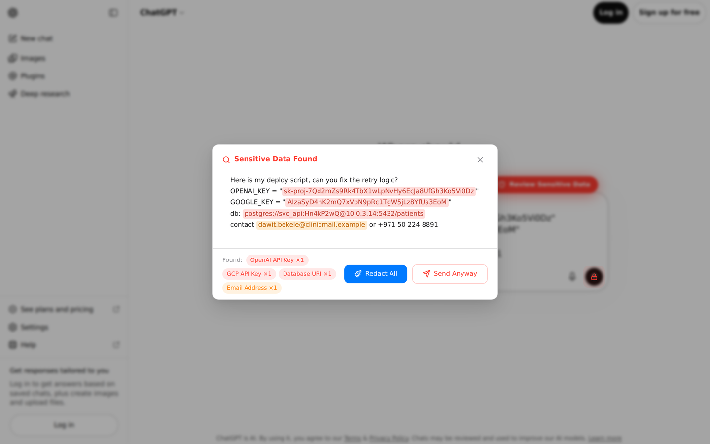

# Prompt Privacy Shield

A Chrome extension that stops you pasting secrets into a chatbot.

When you paste into ChatGPT, Gemini or Claude, it scans the text for API keys, tokens,
database URIs and personal details. If it finds any, it locks the send button and the Enter
key until you either redact the findings or decide to send anyway.

## How it works

- `detector.js` holds the pattern set: provider keys (OpenAI, Anthropic, Google, AWS,
  GitHub, Slack, Hugging Face), private key blocks, JWTs, database connection strings, and
  personal details such as emails and card numbers. Patterns are ordered most specific
  first, each can carry a `validate` hook that rejects obvious placeholders like
  `sk-test-...`, and overlapping matches are de-duplicated so one secret is reported once.
- `content.js` attaches to the composer on each supported site, intercepts the paste,
  and runs the scan. On a hit it blocks sending, shows a review button, and opens a modal
  that highlights every finding in context and offers "Redact All" or "Send Anyway".
  Redaction replaces each finding with a typed placeholder such as `[REDACTED_OPENAI_KEY]`.
- `popup.js` keeps a running count of items protected and lets you add your own patterns,
  as plain words or as `/regex/`.

Everything runs locally. The extension has no backend, no analytics and no network calls;
its only permissions are `activeTab` and `storage`.

## Install

1. Open `chrome://extensions` and turn on Developer mode.
2. Choose "Load unpacked" and select this folder.
3. Open ChatGPT, Gemini or Claude and paste something with a key in it.

There is no build step.

## Known gaps

- Detection is regex only. It finds structured secrets reliably, but it will miss a
  credential that has no recognisable shape, and it does not do named-entity recognition,
  so an unusual phone format or a name in prose can slip through.
- The scan runs on paste and on send, not while you type by hand.
- Selectors track the composers of three specific sites; when one of them redesigns its
  input, the selector list in `content.js` needs updating.
